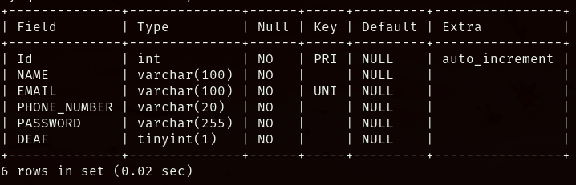
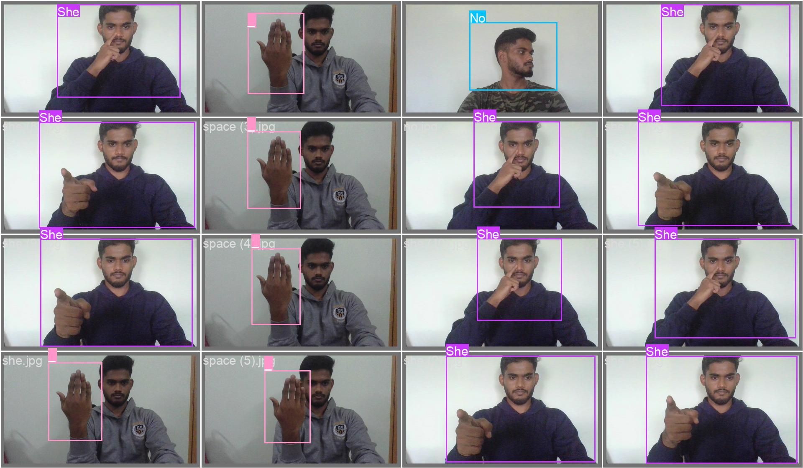

# ISL(Indian Sign Language) Web Application Platform
## This platform converts sign language into text, allowing for better communication between deaf and hearing individuals.

## How To Execute ?
### 1.Navigate to the Project Directory:
```bash
cd SignToText/
```

2.Start Virtual Environment
```bash
python3 -m venv env
```

3.Activate the Virutal Environment:
```bash
source env/bin/activate
```

4.Run the Application
```bash
python app.py
```

## Database setup
Below is the database schema for the application:



## Model Training using YOLO
## Key Note: you can improve the models accuracy by training the more photos with different Lighting effects and position of hand. Use YOLO for training purpose and replace "runs" with your "path/to/your/best.pt"


## Final Real Time sign detection
[Watch Video](images/TrainVideo1_compressed.mp4)

[Watch Video](images/TrainVideo2.mp4)

## License

This project is licensed under the MIT License - see the [LICENSE](LICENSE) file for details.
